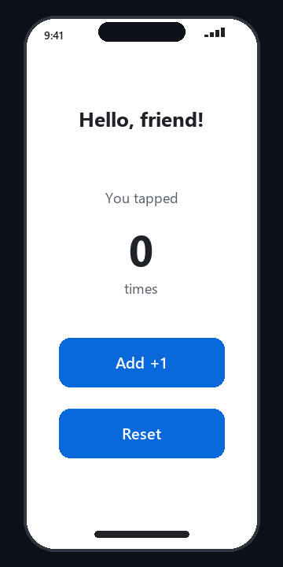
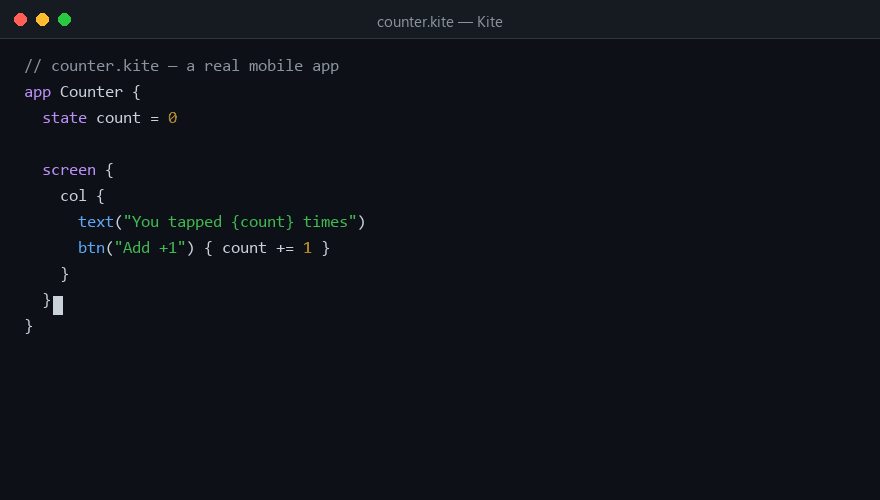
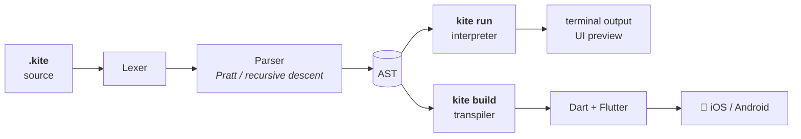

<p align="center">
  
</p>

<p align="center">
  <a href="https://img.shields.io/badge/version-0.1.0-blue"></a>
  <a href="LICENSE"></a>
  
  
  
</p>

<p align="center">
  <b>Kite</b> is a small programming language with its own syntax that compiles
  straight to <b>Flutter</b> — real iOS &amp; Android apps — and ships with a
  built-in interpreter so you can run code instantly on your computer.
</p>

<p align="center">
  
  &nbsp;&nbsp;
  
</p>

---

## Why Kite?

| | |
|---|---|
| 🪁 **Own syntax** | Not Python, not JS — keywords like `make`, `when`, `each`, `set`, `fix` designed to read like English |
| 📱 **Mobile-first** | One `app` block + `state` variables = a reactive Flutter app. State changes rebuild the UI automatically |
| ⚡ **Instant feedback** | `kite run` interprets on your machine — no build step, no waiting |
| 🎯 **Small but complete** | Functions, closures, closures-in-closures, lists, maps, string interpolation, ranges, `when/else`, `while`, `each` loops |
| 🔍 **Zero magic** | ~1,700 lines of readable Python: lexer → parser → interpreter → Dart transpiler |

## Quick start

```bash
git clone https://github.com/TanimowoObaloluwaDavid/kite.git
cd kite

# run a script instantly
python -m kite run examples/script.kite

# preview a mobile app in your terminal
python -m kite run examples/counter.kite

# compile to a real Flutter app
python -m kite build examples/counter.kite -o counter.dart
# → copy into lib/main.dart of any Flutter project, then: flutter run
```

Requires Python 3.8+. Building phone apps additionally requires [Flutter](https://docs.flutter.dev/get-started/install).

## Hello, app

```kite
// counter.kite
app Counter {
  state count = 0

  screen {
    col {
      text("You tapped {count} times")
      btn("Add +1") {
        count += 1          // the UI rebuilds itself — no boilerplate
      }
      btn("Reset") {
        count = 0
      }
    }
  }
}
```

That's the whole app. `kite build` turns it into a Flutter `StatefulWidget`
with proper `setState` wiring.

## Language tour

### Variables

```kite
set name = "Ada"        // mutable
fix pi = 3.14159        // constant — reassignment is a compile error
score += 1              // += -= *= /=
```

### Functions & closures

```kite
make greet(who) {
  ret "Hey " + who
}

set add = make(a, b) { ret a + b }   // anonymous function

set makeAdder = make(n) {
  ret make(x) { ret x + n }          // closure captures n
}
print(makeAdder(5)(10))              // => 15
```

### Control flow

```kite
when score > 100 {
  print("high score")
} else when score > 50 {
  print("good")
} else {
  print("keep going")
}

each i in 0..5 {          // ranges: 0 1 2 3 4
  print(i)
}

while loading {
  tick()
}
```

`and` / `or` / `not` for logic, `is` / `isnt` for equality, and
`break` / `continue` in loops.

### Data

```kite
set nums = [1, 2, 3]
nums.push(4)

set user = #{name: "Ada", age: 36}
print("Hello, {user.name}!")     // string interpolation with { }

print(nums.join(", "))           // => 1, 2, 3, 4
print("hi".upper())              // => HI
print(len(user))                 // => 2
```

### Widgets

| Kite | Compiles to |
|---|---|
| `col { … }` | `Column` |
| `row { … }` | `Row` |
| `text(s)` | `Text` |
| `btn(label) { … }` | `ElevatedButton` wrapped in `setState` |
| `input(hint)` | `TextField` |
| `img(url)` | `Image.network` |
| `spacer(n)` | `SizedBox(height: n)` |

Loops and conditionals work inside widgets too — they compile to Dart's
collection-`for` / collection-`if`:

```kite
screen {
  col {
    each t in tasks {
      text("[ ] {t}")
    }
    when len(tasks) == 0 {
      text("Nothing to do!")
    }
  }
}
```

## How it works



| Stage | File | What it does |
|---|---|---|
| Lexer | `kite/lexer.py` | source → tokens, with string-escape handling |
| Parser | `kite/parser.py` | tokens → AST; Pratt expression parsing, `{…}` trailing widget blocks |
| Interpreter | `kite/interp.py` | tree-walking evaluator with lexical scoping, closures, `fix` immutability |
| Transpiler | `kite/transpile.py` | AST → idiomatic Dart; `state` → fields, `btn` → `setState`, loops → collection-`for` |
| CLI | `kite/__main__.py` | `run` · `build` · `ast` · `check` |

## Commands

```
python -m kite run  app.kite      # interpret (apps print as a terminal preview)
python -m kite build app.kite     # compile to Dart for Flutter
python -m kite ast app.kite       # dump the parse tree (debugging)
python -m kite check app.kite     # syntax check only
```

## Project layout

```
kite/
├── kite/                 # the language implementation
│   ├── lexer.py
│   ├── parser.py
│   ├── ast.py
│   ├── interp.py
│   ├── transpile.py
│   └── __main__.py       # CLI
├── examples/
│   ├── script.kite       # fib, loops, maps — runs in the interpreter
│   ├── counter.kite      # reactive counter app
│   └── todo.kite         # list UI with loops inside widgets
├── tests/test_kite.py    # 24 tests, zero dependencies
├── scripts/make_assets.py
└── DESIGN.md             # the language spec
```

## Testing

```bash
python tests/test_kite.py        # plain Python, no pytest needed
# or, if you have pytest:
pytest tests/ -q
```

24 tests cover lexing, parsing, arithmetic, closures, control flow, data
structures, error messages, and the Dart output.

## Roadmap

- [ ] `when` guards on maps/lists (`has`, pattern matching)
- [ ] Classes / structs with methods
- [ ] Hot reload — watch a `.kite` file and rebuild the Dart output
- [ ] Custom widget definitions (`make myCard(...) { … }` returning widgets)
- [ ] Publish to PyPI as `kite-lang`

## License

[MIT](LICENSE) — fly it wherever you want.

---

<p align="center">
  
  <br><br>
  <sub>Built with Python, Pillow and Flutter. Issues? →
  <a href="https://github.com/TanimowoObaloluwaDavid/kite/issues">open an issue</a></sub>
</p>
