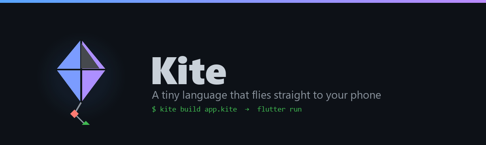
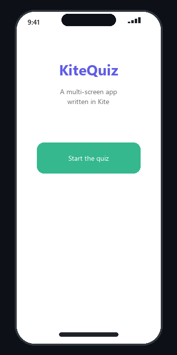
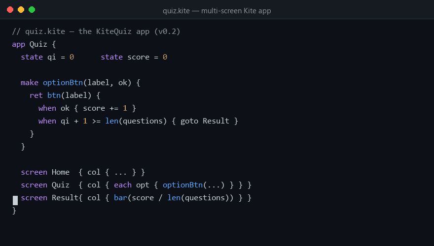
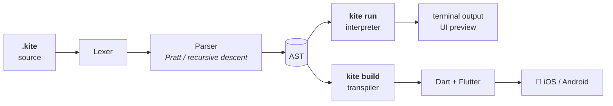
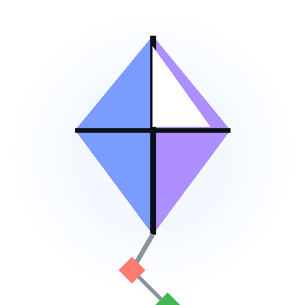

<p align="center">
  
</p>

<p align="center">
  <a href="https://img.shields.io/badge/version-0.2.0-blue"></a>
  <a href="LICENSE"></a>
  
  
  
</p>

<p align="center">
  <b>Kite</b> is a small programming language with its own syntax that compiles
  straight to <b>Flutter</b> — real iOS &amp; Android apps — and ships with a
  built-in interpreter so you can run code instantly on your computer.
</p>

<p align="center">
  
  &nbsp;&nbsp;
  
</p>
<p align="center"><em>The KiteQuiz demo — a real multi-screen app (3 screens, <code>goto</code>
navigation, custom components) previewed live in the terminal.</em></p>

---

## Why Kite?

| | |
|---|---|
| 🪁 **Own syntax** | Not Python, not JS — keywords like `make`, `when`, `each`, `set`, `goto` designed to read like English |
| 📱 **Mobile-first** | One `app` block + `state` = a reactive Flutter app. Multiple `screen`s with `goto`, `Scaffold`/`SafeArea` output |
| 🔩 **Composable UI** | Write your own widget components (`make card(...) { ret ... }`) and reuse them anywhere |
| ⚡ **Instant feedback** | `kite run` previews every screen of your app right in the terminal — no build, no waiting |
| 🎯 **Small but complete** | Functions, closures, lists, maps, interpolation, ranges, `when/else`, `while`, `each`, `break`/`continue` |
| 🔍 **Zero magic** | ~1,900 lines of readable Python: lexer → parser → interpreter → Dart transpiler |

## Quick start

```bash
git clone https://github.com/TanimowoObaloluwaDavid/kite.git
cd kite

# run a script instantly
python -m kite run examples/script.kite

# preview a mobile app in your terminal
python -m kite run examples/quiz.kite      # the multi-screen KiteQuiz app

# compile to a real Flutter app
python -m kite build examples/quiz.kite -o quiz.dart
# → copy into lib/main.dart of any Flutter project, then: flutter run
```

Requires Python 3.8+. Building phone apps additionally requires [Flutter](https://docs.flutter.dev/get-started/install).

## The flagship example — KiteQuiz

[`examples/quiz.kite`](examples/quiz.kite) is a complete, multi-screen quiz
app written in ~90 lines of Kite — no Flutter code, no controllers, no
boilerplate:

```kite
// quiz.kite  (excerpt)
app Quiz {
  state qi = 0                    // which question we're on
  state score = 0

  set questions = [
    #{ q: "What language created the World Wide Web?", a: 3, opts: [
        #{ t: "Python", ok: false },  #{ t: "HTML", ok: false },
        #{ t: "C", ok: false },       #{ t: "JavaScript", ok: true },
    ] },
    // ... more questions
  ]

  make optionBtn(label, ok) {      // your own widget component
    ret btn(label) {
      when ok { score += 1 }
      when qi + 1 >= len(questions) { goto Result } else { qi += 1 }
    }
  }

  screen Home { col {
    text("KiteQuiz", 42, "#5E5CE6")
    btn("Start the quiz", "#35B88E") { qi = 0; score = 0; goto Quiz }
  } }

  screen Results { col {
    text("{score} / {len(questions)} correct", 22, "#35B88E")
    bar(score / len(questions))                   // progress bar
    btn("Play again") { qi = 0; score = 0; goto Home }
  } }
}
```

It uses three named `screen`s with `goto` navigation, a custom `optionBtn`
component reused inside an `each` loop, styled `text`, and a `bar` progress
widget — try it:

```bash
python -m kite run examples/quiz.kite        # preview all screens at once
python -m kite build examples/quiz.kite -o quiz.dart   # compile to Flutter
```

## Hello, app

```kite
// counter.kite
app Counter {
  state count = 0

  screen {
    col {
      text("You tapped {count} times")
      btn("Add +1") {
        count += 1          // the UI rebuilds itself — no boilerplate
      }
      btn("Reset") {
        count = 0
      }
    }
  }
}
```

That's the whole app. `kite build` turns it into a Flutter `StatefulWidget`
wrapped in `Scaffold`/`SafeArea`, with every `btn` body wired through
`setState` — your UI rebuilds whenever state changes.

## Language tour

### Variables

```kite
set name = "Ada"        // mutable
fix pi = 3.14159        // constant — reassignment is a compile error
score += 1              // += -= *= /=
```

### Functions & closures

```kite
make greet(who) {
  ret "Hey " + who
}

set add = make(a, b) { ret a + b }   // anonymous function

set makeAdder = make(n) {
  ret make(x) { ret x + n }          // closure captures n
}
print(makeAdder(5)(10))              // => 15
```

### Control flow

```kite
when score > 100 {
  print("high score")
} else when score > 50 {
  print("good")
} else {
  print("keep going")
}

each i in 0..5 {          // ranges: 0 1 2 3 4
  print(i)
}

while loading {
  tick()
}
```

`and` / `or` / `not` for logic, `is` / `isnt` for equality, and
`break` / `continue` in loops.

### Data

```kite
set nums = [1, 2, 3]
nums.push(4)

set user = #{name: "Ada", age: 36}
print("Hello, {user.name}!")     // string interpolation with { }

print(nums.join(", "))           // => 1, 2, 3, 4
print("hi".upper())              // => HI
print(len(user))                 // => 2
```

### Widgets

| Kite | Compiles to |
|---|---|
| `col { … }` | `Column` |
| `row { … }` | `Row` |
| `text(s)` | `Text` |
| `text(s, size)` / `text(s, size, "#color")` | `Text` with `TextStyle` |
| `btn(label) { … }` | `ElevatedButton` wrapped in `setState` |
| `btn(label, "#color")` | colored `ElevatedButton` |
| `input(hint)` | `TextField` |
| `img(url)` | `Image.network` |
| `spacer(n)` | `SizedBox(height: n)` |
| `bar(fraction)` | `LinearProgressIndicator` |

### Multi-screen apps

Give each `screen` a name and jump between them with `goto`:

```kite
app Nav {
  state n = 0
  screen Home { col {
    text("Welcome!")
    btn("Go") { goto About }
  } }
  screen About { col {
    text("This is the about screen")
    btn("Back") { goto Home }
  } }
}
```

`goto` compiles to `setState`, screens render through `Scaffold`/`SafeArea`,
and `kite run` previews every screen in your terminal at once.

### Custom widget components

Write a component once with `make`, return a widget with `ret`, reuse it anywhere:

```kite
make optionBtn(label, picked) {
  ret btn(label) {
    when picked { score += 1 }
  }
}

screen Quiz {
  col {
    each opt in options {
      optionBtn(opt.label, opt.picked)
    }
  }
}
```

Loops and conditionals work inside widgets too — they compile to Dart's
collection-`for` / collection-`if`:

```kite
screen {
  col {
    each t in tasks {
      text("[ ] {t}")
    }
    when len(tasks) == 0 {
      text("Nothing to do!")
    }
  }
}
```

## How it works



| Stage | File | What it does |
|---|---|---|
| Lexer | `kite/lexer.py` | source → tokens, with string-escape handling |
| Parser | `kite/parser.py` | tokens → AST; Pratt expression parsing, `{…}` trailing widget blocks |
| Interpreter | `kite/interp.py` | tree-walking evaluator with lexical scoping, closures, `fix` immutability |
| Transpiler | `kite/transpile.py` | AST → idiomatic Dart; `state` → fields, `btn` → `setState`, loops → collection-`for` |
| CLI | `kite/__main__.py` | `run` · `build` · `ast` · `check` |

## Commands

```
python -m kite run  app.kite      # interpret (apps print as a terminal preview)
python -m kite build app.kite     # compile to Dart for Flutter
python -m kite ast app.kite       # dump the parse tree (debugging)
python -m kite check app.kite     # syntax check only
```

## Project layout

```
kite/
├── kite/                 # the language implementation
│   ├── lexer.py
│   ├── parser.py
│   ├── ast.py
│   ├── interp.py
│   ├── transpile.py
│   └── __main__.py       # CLI
├── examples/
│   ├── script.kite       # fib, loops, maps — runs in the interpreter
│   ├── counter.kite      # reactive counter app
│   ├── todo.kite         # list UI with loops inside widgets
│   └── quiz.kite         # ⭐ KiteQuiz — multi-screen app (goto + components)
├── assets/               # README images & GIFs (generated)
│   ├── logo.png · banner.png
│   ├── counter.gif · terminal.gif
│   └── quiz.gif · quiz-terminal.gif
├── tests/test_kite.py    # 29 tests, zero dependencies
├── scripts/make_assets.py
└── DESIGN.md             # the language spec
```

## Testing

```bash
python tests/test_kite.py        # plain Python, no pytest needed
# or, if you have pytest:
pytest tests/ -q
```

29 tests cover lexing, parsing, arithmetic, closures, control flow, data
structures, error messages, multi-screen navigation, custom components, and
the Dart output.

## Roadmap

- [x] Multi-screen apps: named `screen`s + `goto` navigation
- [x] Custom widget components (`make myCard(...) { ret ... }`)
- [x] `bar` progress widget, styled `text`/`btn`
- [ ] `when` guards on maps/lists (`has`, pattern matching)
- [ ] Classes / structs with methods
- [ ] Hot reload — watch a `.kite` file and rebuild the Dart output
- [ ] Publish to PyPI as `kite-lang`

## License

[MIT](LICENSE) — fly it wherever you want.

---

<p align="center">
  
  <br><br>
  <sub>Built with Python, Pillow and Flutter. Issues? →
  <a href="https://github.com/TanimowoObaloluwaDavid/kite/issues">open an issue</a></sub>
</p>
